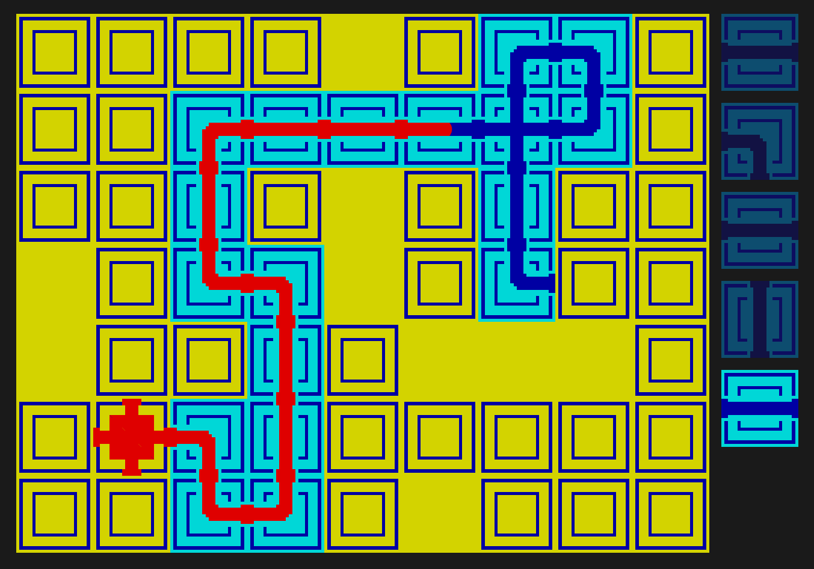
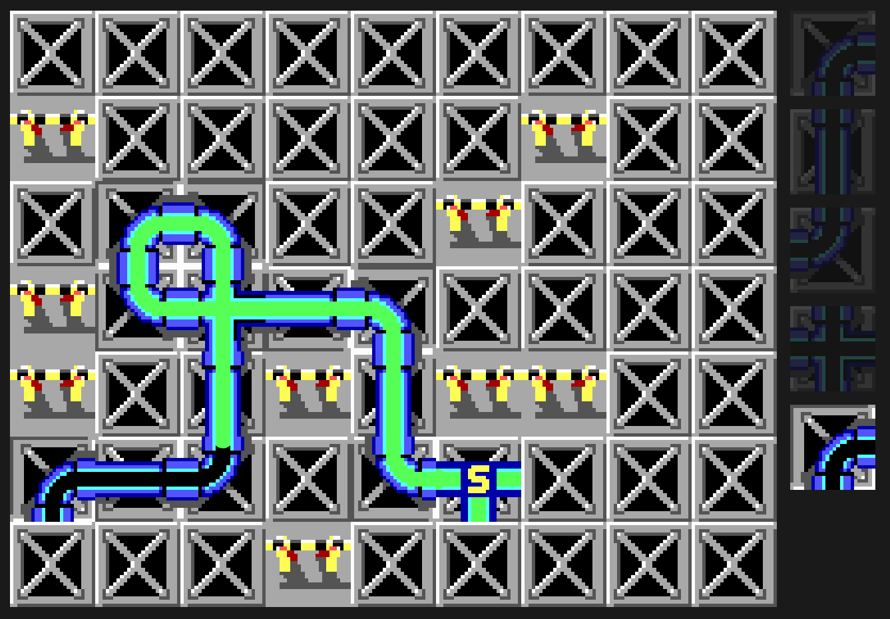

# Pipe Mania - Browser Puzzle Game

A browser-based puzzle game inspired by the classic Pipe Mania, built with TypeScript and PixiJS.

## 🎮 Play Online

**[Play the game here!](https://oneiros90.github.io/Arkadium-Pipe-Mania/)**

## 📋 Game Description

Connect pipes to guide flowing water from the start point through the grid. Build a continuous path of at least the minimum required length before the water reaches the end!

### Game Mechanics

- **Grid**: 9x7 cells with randomly placed obstacles
- **Pipe Types**: Straight, curved, and cross pipes in random rotations
- **Objective**: Create a valid water path of minimum required length
- **Win Condition**: Complete the required path length before water reaches a dead-end
- **Lose Condition**: Water exits the valid path or reaches a dead-end prematurely

## 📸 Screenshots

| Classic Theme | MS-DOS Theme |
|:---:|:---:|
|  |  |

## 🚀 Development

### Prerequisites

- Node.js 18+ 
- npm

### Installation

```bash
npm install
```

### Development Server

```bash
npm run dev
```

The game will open at `http://localhost:3000`

### Build for Production

```bash
npm run build
```

Output will be in the `docs/` directory.

### Preview Production Build

```bash
npm run preview
```

### Running Tests

```bash
npm test
```

## 🎨 Themes

The game supports multiple visual themes. Configure in `config/game.yaml`:

- `original` - Classic pipe mania aesthetics
- `ms-dos` - Retro MS-DOS inspired theme with green water

## ⚙️ Configuration

All gameplay parameters are configurable via YAML files in the `config/` directory:

### `config/game.yaml`
- Grid dimensions
- Gameplay rules (flow speed, minimum path length)
- Pipe type distribution and weights
- Random seed (for reproducible games)
- Visual theme selection

### `config/visual-*.yaml`
- Asset paths
- Colors and visual effects
- Water flow rendering parameters
- UI layout settings

## 🏗️ Architecture

The codebase follows SOLID principles with clean separation of concerns:

- **Core**: Base abstractions (`Pipe`, `Cell`, `Grid`)
- **Entities**: Concrete implementations (pipe/cell types)
- **Systems**: Game logic (flow, path validation, pipe factory)
- **Rendering**: PixiJS-based visualization (grid, queue, water flow)
- **Config**: Zod-validated YAML configuration

### Key Design Patterns

- **Registry Pattern**: `PipeRegistry` for extensible pipe type management
- **Strategy Pattern**: Abstract rendering methods for cells and pipes
- **Factory Pattern**: `PipeFactory` for weighted random pipe generation
- **Observer Pattern**: Grid update notifications for rendering

## 🧪 Testing

The project includes comprehensive unit tests for core game logic:

- Grid initialization and cell management
- Water flow simulation
- Path validation
- Pipe creation and rotation

Tests use deterministic seeded RNG for reproducibility.

## 📦 Deployment

The project is automatically deployed to GitHub Pages via GitHub Actions on every push to `main`.

### Manual Deployment

1. Ensure `base` in `vite.config.ts` matches your repository name
2. Run `npm run build`
3. Commit the `docs/` directory
4. Enable GitHub Pages in repository settings (source: `docs/`)

## 🛠️ Technologies

- **TypeScript** - Type-safe game logic
- **PixiJS** - High-performance 2D rendering
- **Vite** - Fast build tooling
- **Vitest** - Unit testing
- **Zod** - Runtime type validation
- **js-yaml** - Configuration file parsing

## 📝 License

ISC

## 🙏 Credits

Inspired by the classic [Pipe Mania](https://en.wikipedia.org/wiki/Pipe_Mania) puzzle game.
